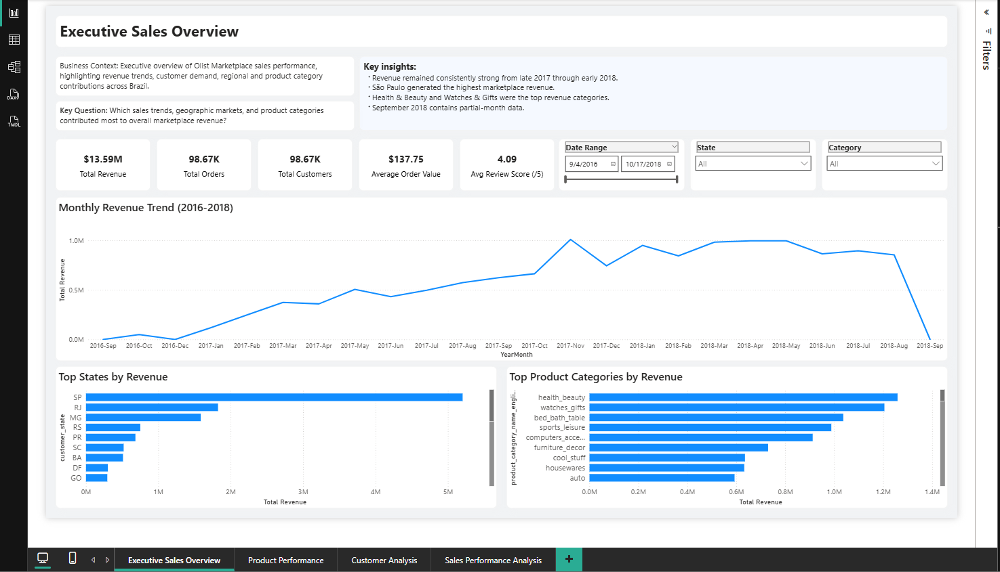
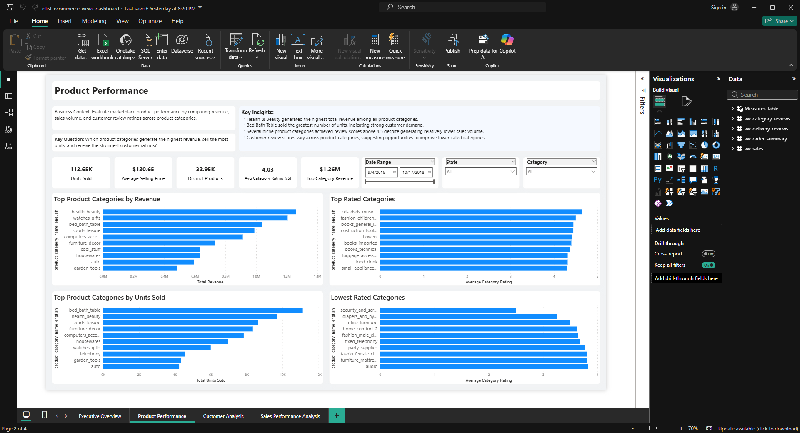
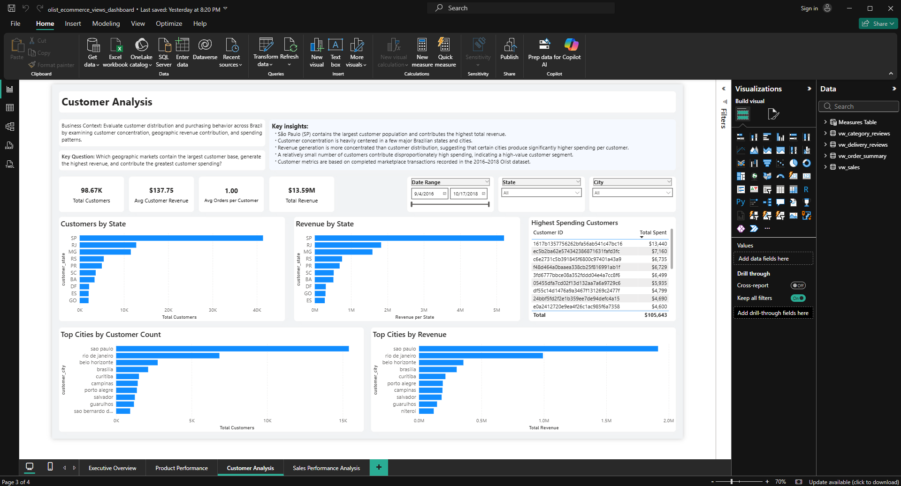
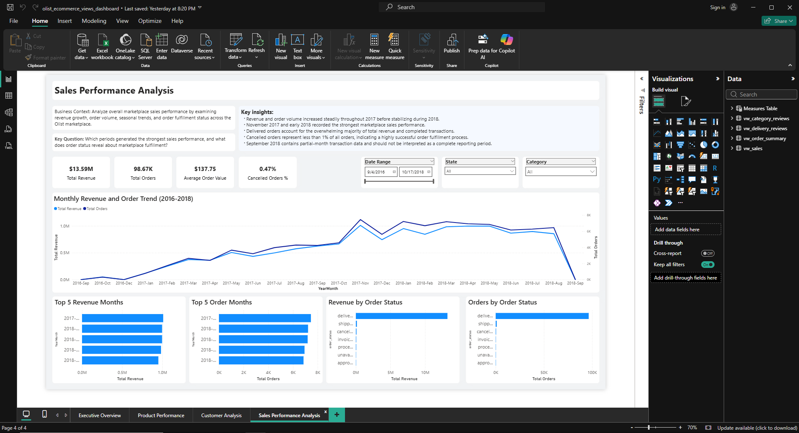

# Olist E-Commerce Business Intelligence Dashboard
End-to-end Business Intelligence project using PostgreSQL and Power BI on the Olist Brazilian E-Commerce Dataset.

## Dashboard Preview

### Executive Sales Overview
A high-level overview of marketplace performance, covering revenue, customers, orders, sales trends, and regional distributions.

### Product Performance
Evaluates product categories based on revenue, units sold, and customer ratings to identify top-performing and underperforming categories.

### Customer Analysis
Analyzes customer distribution, geographic revenue contribution, and purchasing behavior across Brazilian states and cities.

### Sales Performance Analysis
Examines revenue trends, order volume, seasonality, and order fulfillment performance over time.

## Project Overview
This is an end-to-end Business Intelligence project using PostgreSQL and Power BI to analyze the Olist Brazilian E-Commerce Public Dataset. The goal of this project was to transform raw Olist marketplace data into interactive Power BI dashboards that help analyze sales, products, and customer behavior.

## Business Objectives
- Analyze market performance
- Identify top-performing product categories
- Assess customer purchasing behavior
- Monitor monthly sales trends
- Support business decision-making through interactive dashboards

## Dataset
- Dataset Source: [Olist Brazilian E-Commerce Public Dataset](https://www.kaggle.com/datasets/olistbr/brazilian-ecommerce)
- The dataset contains over 100,000 Brazilian E-Commerce marketplace transactions from Olist, covering September 2016 through September 2018, including customers, orders, products, payments, reviews, and sellers.

## Tools Used

### Database
- PostgreSQL
- pgAdmin 4

### Visualization
- Power BI

### Languages
- SQL
- DAX

### Dataset
- Olist Brazilian E-Commerce Public Dataset (Kaggle)

## Skills Demonstrated
- SQL querying and data preparation
- Relational database design
- Data modeling in Power BI
- DAX measure development
- Interactive dashboard design
- Business reporting and KPI development
- Data storytelling and visualization

## SQL Highlights
SQL was used for data preparation, business analysis, KPI generation, and reusable reporting views using:
- JOINs
- CTEs
- Aggregate functions
- Window functions
- Views
- GROUP BY
- ORDER BY
- LIMIT

## Key DAX Measures
Key DAX measures were developed to calculate KPIs and business metrics, including:
- Total Revenue
- Average Order Value
- Average Revenue per Customer
- Cancelled Orders %
- Revenue per State
- Top Category Revenue
- Top Customer Spend

## Key Insights
- Revenue experienced sustained growth through late 2017 and peaked during early 2018.
- São Paulo generated the highest revenue and customer concentration.
- Health & Beauty generated the highest revenue among all product categories.
- Order fulfillment remained healthy, with cancelled orders accounting for less than 1% of total transactions.
- Customer review scores remained consistently above 4.0 across most categories.

## Future Improvements
- Add a Seller Performance Dashboard
- Implement Sales Forecasting using Power BI Forecast Analytics
- Automate Scheduled Data Refresh
- Publish the Dashboard using Power BI Service

## Author

**Clifford Crisostomo**

- Computer Science Graduate
- Aspiring Data Analyst / SQL Developer
